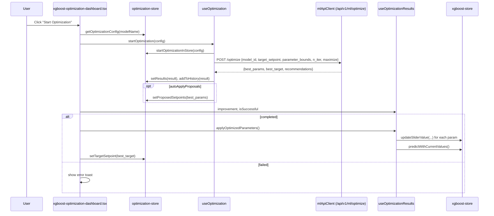
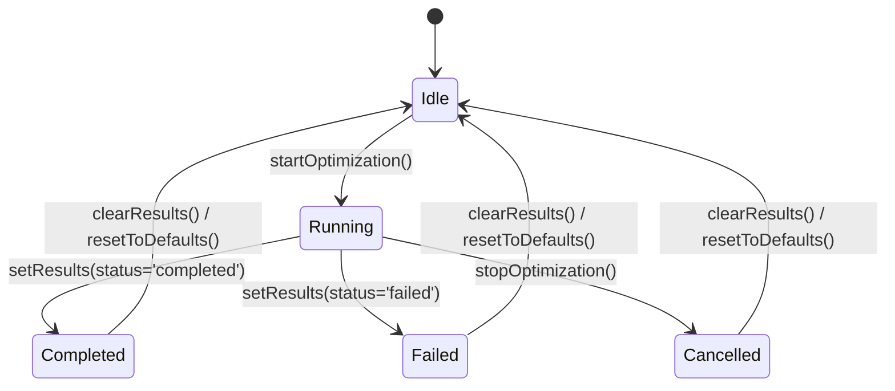

# Optimization Store (Zustand) — Architecture, Data Flow, and Integration

Location: `src/app/mills-ai/stores/optimization-store.ts`

This document explains the state model, actions, and how the optimization store connects to the UI and the ML API. It also maps the full data flow from user interaction to backend requests and back to UI updates.

---

## Purpose

- Manage optimization configuration (target setpoint, parameter bounds, iterations, goal maximize/minimize).
- Track optimization lifecycle (start/stop/progress/results/history).
- Hold proposed setpoints and best parameters and expose helpers to build API requests.
- Integrate with UI components and the XGBoost store to apply optimized parameters.

---

## Public Types

- `OptimizationConfig`
  - `model_id: string`
  - `target_setpoint: number`
  - `parameter_bounds: Record<string, [number, number]>`
  - `n_iter: number`
  - `maximize: boolean`

- `OptimizationResult`
  - `id: string`
  - `timestamp: number`
  - `config: OptimizationConfig`
  - `best_parameters: Record<string, number>`
  - `best_score: number`
  - `optimization_history: Array<{ iteration: number; parameters: Record<string, number>; score: number }>`
  - `convergence_data: Array<{ iteration: number; best_score: number }>`
  - `feature_importance?: Record<string, number>`
  - `recommendations?: string[]`
  - `duration_seconds: number`
  - `status: 'running' | 'completed' | 'failed' | 'cancelled'`
  - `error_message?: string`

- `OptimizationMode = 'training' | 'runtime'`

- `OptimizationState` (Zustand store shape)
  - Configuration: `targetSetpoint`, `parameterBounds`, `iterations`, `maximize`
  - Settings: `autoApplyProposals`
  - Mode: `optimizationMode`
  - Status: `isOptimizing`, `optimizationProgress`, `currentOptimizationId`
  - Results: `currentResults`, `optimizationHistory`, `bestParameters`, `proposedSetpoints`
  - Actions: see below

---

## Defaults

- `targetSetpoint`: 50.0
- `parameterBounds`: `{}` (initialized from XGBoost feature bounds in the UI)
- `iterations`: 50
- `maximize`: true
- `autoApplyProposals`: false
- `optimizationMode`: `'training'`
- Status and Results: idle/empty by default

---

## Actions (Store API)

Configuration
- `setTargetSetpoint(value)`
- `updateParameterBounds(id, bounds)` — sets the optimization range for a single parameter
- `setParameterBounds(bounds)` — bulk set all ranges
- `setIterations(iterations)`
- `setMaximize(maximize)`
- `setOptimizationMode(mode)`

Lifecycle
- `startOptimization(config)` — sets `isOptimizing`, `currentOptimizationId`, resets progress
- `stopOptimization()` — clears optimizing flags
- `updateProgress(progress)` — clamps [0..100]
- `setOptimizationId(id)`

Results
- `setResults(results)` — sets `currentResults`, `bestParameters`, `isOptimizing` (from result status), and auto-100% progress when completed
- `addToHistory(results)` — unshift to history, keep last 50
- `clearResults()`
- `clearHistory()`

Proposals
- `setProposedSetpoints(setpoints)`
- `clearProposedSetpoints()`
- `setAutoApplyProposals(auto)` — when true, `useOptimization()` autopopulates proposals from `best_parameters`

Utilities
- `getOptimizationConfig(modelId)` — builds the exact payload shape required by the API
- `resetToDefaults()` — resets store while preserving `optimizationHistory` and `currentResults`
- `isTrainingMode()` / `isRuntimeMode()`

---

## Data Flow Overview (End-to-End)

```mermaid
flowchart LR
  UI[UI: xgboost-optimization-dashboard.tsx] -->|getOptimizationConfig(modelId)| Store((optimization-store))
  UI -->|startOptimization(config)| Hook[useOptimization]
  Hook -->|POST /api/v1/ml/optimize| API[(mlApiClient)]
  API -->|response| Hook
  Hook -->|setResults + addToHistory| Store
  Store -->|best_parameters| HookResults[useOptimizationResults]
  HookResults -->|updateSliderValue + predictWithCurrentValues| XGBStore[(xgboost-store)]
  XGBStore --> TargetDisplay[TargetFractionDisplay]
  Store --> UI
  Store --> ParamCards[ParameterOptimizationCard]
```

Key files:
- `stores/optimization-store.ts` — the store
- `hooks/useOptimization.ts` — calls backend and writes results into the store
- `hooks/useOptimizationResults.ts` — applies best parameters to XGBoost store and computes derived insights
- `optimization/components/xgboost-optimization-dashboard.tsx` — orchestrates UI and triggers optimization
- `optimization/components/parameter-optimization-card.tsx` — per-parameter range UI using store state
- `components/target-fraction-display.tsx` — shows PV/SP trends; receives optimized target SP for overlay

---

## Sequence: Start Optimization Button



---

## Integration Details

### With the Optimization UI
- `xgboost-optimization-dashboard.tsx`
  - Initializes optimization ranges from `useXgboostStore().parameterBounds` into `useOptimizationStore().parameterBounds` (10% inside feature bounds by default).
  - Builds config via `getOptimizationConfig(modelName)` and calls `useOptimization().startOptimization(config)`.
  - Displays progress and success/failure state.
  - On success: calls `useOptimizationResults().applyOptimizedParameters()` and updates `targetSetpoint` to the optimized `best_score`.
  - Forces real-time mode (PV) on mount: `useXgboostStore().setSimulationMode(false)`.

- `parameter-optimization-card.tsx`
  - Receives `rangeValue` from `optimization-store.parameterBounds[parameter.id]` and emits `onRangeChange` → `updateParameterBounds(id, range)`.
  - Displays trend area for process parameters and overlays:
    - Shaded optimization bounds via `DoubleRangeSlider` range
    - Proposed setpoint line (orange) if present via `proposedSetpoints?.[id]`.

- `TargetFractionDisplay`
  - Props `spOptimize={targetSetpoint}` and `showOptimizationTarget` let the chart render the optimized target reference line alongside PV/SP.

### With the XGBoost Store
- `useOptimizationResults().applyOptimizedParameters()`
  - Applies `best_parameters` by calling `useXgboostStore().updateSliderValue(paramId, value)` for each.
  - Triggers `useXgboostStore().predictWithCurrentValues()` so the target SP is recomputed and chart updates.
  - Note on modes: dashboard forces `simulationMode=false` to prefer PV for process params and slider values for lab params (hybrid logic in the XGBoost store).

### With the ML API
- API client: `src/app/mills-ai/utils/api-client.ts`
  - `mlApiClient` base URL: `${NEXT_PUBLIC_API_URL || 'http://localhost:8000'}/api/v1/ml`
- Hook: `hooks/useOptimization.ts`
  - Sends `OptimizationConfig` to `POST /optimize`.
  - Maps response to `OptimizationResult`:
    - `best_parameters` ← `data.best_params`
    - `best_score` ← `data.best_target`
    - `optimization_history`/`convergence_data` synthesized from `data.recommendations` (`predicted_value`, `params`).
  - On success: `setResults`, `addToHistory`, optionally `setProposedSetpoints` if `autoApplyProposals` is true.
  - On failure: writes a `failed` result, adds to history, and stops optimization in store.

---

## Store State Machine (Conceptual)



Notes:
- `startOptimization()` sets `isOptimizing=true` and creates a client-side `currentOptimizationId`.
- The actual status is carried inside `OptimizationResult.status` from the hook’s mapping of API outcome.

---

## How Parameter Bounds Are Initialized

- The dashboard derives full feature bounds from `useXgboostStore().parameterBounds`.
- For optimization, it initializes ranges to 10% inside these bounds per feature:
  - `lo = b[0] + 0.1 * (b[1] - b[0])`
  - `hi = b[1] - 0.1 * (b[1] - b[0])`
- Subsequent user edits are persisted in `optimization-store.parameterBounds`.

---

## Proposed Setpoints vs Best Parameters

- `bestParameters` are parsed from the last optimization result.
- If `autoApplyProposals` is enabled, `useOptimization` writes `setProposedSetpoints(best_parameters)`.
- UI uses `proposedSetpoints?.[parameter.id]` to render a suggested horizontal line and label per parameter card.
- `applyOptimizedParameters()` writes these values into the XGBoost store sliders and triggers a fresh prediction.

---

## Error Handling & Resilience

- API errors are caught in `useOptimization()`, which:
  - Sets a `failed` result into the store (with `error_message`).
  - Adds it to history for traceability.
  - Clears optimizing flags.
- The dashboard shows a red error banner and keeps controls operable.

---

## Devtools & Persistence

- The store is wrapped in `devtools` with name `'optimization-store'` for easy inspection in Redux/Zustand DevTools.
- No persistence is used; state resets on page reload (history is in-memory across session only).

---

## Minimal Trend Handling (Performance Note)

- Parameter cards filter trend by `displayHours` from `xgboost-store` and plot directly without downsampling—honors the project’s preference for minimal processing of trend data.

---

## Quick Reference (Common Calls)

```ts
// Build config and run
const config = useOptimizationStore.getState().getOptimizationConfig(modelId)
const result = await useOptimization().startOptimization(config)

// Update a single parameter’s optimization range
useOptimizationStore.getState().updateParameterBounds('WaterMill', [35, 47])

// Apply best parameters to sliders and re-predict
useOptimizationResults().applyOptimizedParameters()

// Toggle maximize/minimize
useOptimizationStore.getState().setMaximize(true)
```

---

## Future Extensions

- API-side progress streaming or polling to update `optimizationProgress` during long runs.
- Feature importance wiring when backend provides it.
- Persist last-used optimization ranges per model.
- Cancellation support if backend exposes an endpoint keyed by `currentOptimizationId`.
